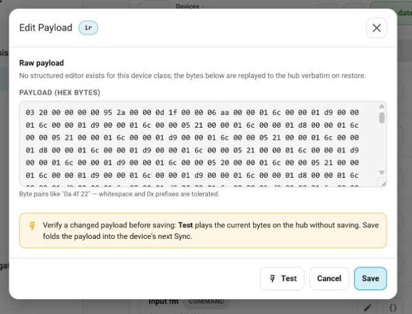

# IrScrutinizer Exporters For Sofabaton Blobs

This directory contains custom IrScrutinizer export formats for generating
blob-ready output for the Sofabaton Home Assistant integration.

These exporters are intended to bridge two worlds:

- IrScrutinizer, which can import, decode, analyze, and render IR signals from local, physical or online sources
- the Sofabaton integration's **Blobs** workflow, where users test and save IR
  command payloads to the hub

If you are new to blobs, read [../docs/blobs.md](../docs/blobs.md)
first.

With these exporters users convert IR signals into Sofabaton hub-compatible Blobs.

## Files in this directory

- [sofabaton-x.xml](sofabaton-x.xml)
  exports the raw timing-style Sofabaton IR blob used by all X-series hubs.
- [sofabaton-x2.xml](sofabaton-x2.xml)
  exports the X2's descriptive ASCII form, such as
  `P:Sony12 R:40000 D:1 F:18 MUL:2`.
- [x2-protocols.md](x2-protocols.md)
  is a maintainer note with current protocol validation status for the X2
  exporter.

## Limitations

There are 2 ways that a Sofabaton hub stores IR Blobs:

- The **raw IR format** describes the signal by its actual transmitted timings: carrier frequency plus the sequence of mark/space durations. It is a low-level recording of what the hub should send. The **raw IR format** is supported on **all hubs**.
- The **descriptive format** describes the same signal by its decoded protocol and parameter values, like `P:Sony12 R:40000 D:1 F:18 MUL:2`. It is a higher-level, human-readable representation of what the signal means. The **descriptive format** is supported on the **X2 hub only**.

Both types of Blob appear to require an IR Protocol identifier. In the descriptive format that is very obvious, and making a mistake there will render the Blob useless.  
In the raw format there also appears to be a Protocol identifier. For this the hub doesn't seem to care which one is used, as long as it's a valid one. This would make sense, as the raw format is by its very nature protocol agnostic. It's very possible that the protocol identifier is just there as metadata.
What that means for these exporters:

- The raw format exporter uses a hardcoded identifier. This has been observed to work across a range of different devices and protocols. If it turns out that some commands do not work the exporter will have to be extended. If you're interested, open an exporter in a text editor.
- The descriptive exporter implements a mapping between Protocol naming conventions of the Sofabaton hub and those used in IrScrutinizer, and generates checksums when required. This mapping is incomplete! A fair amount of protocols have been mapped, but certainly this is not exhaustive.

All known IR commands can be converted into Sofabaton compatible Blobs, it is a matter of mapping protocol labels.

## Installation

- Download and install [IrScrutinizer](https://github.com/bengtmartensson/IrScrutinizer).
  Grab the installer for your platform from [this page](https://github.com/bengtmartensson/IrScrutinizer/releases).

- Once IrScrutinizer is installed:
  1. Copy `sofabaton-x.xml` and/or `sofabaton-x2.xml` into IrScrutinizer's
     `exportformats.d` folder.
  2. Restart IrScrutinizer, or in the app select:
     `Options -> Export formats database -> Reload`
  3. Open the **Export** pane and look for the new formats:
  - `Sofabaton X-series`
  - `Sofabaton X2`

## What the exporters produce

### `Sofabaton X-series`

This exporter emits a single raw Sofabaton IR blob as a hex string with spaces
between bytes.

The current implementation:

- uses a fixed 6-byte header: `00 00 03 20 00 00`
- writes the carrier frequency as a 4-byte big-endian integer in Hz
- writes every `flash` and `gap` duration as 4-byte big-endian microseconds
- preserves the signal structure already present in Girr:
  intro, repeat, and ending are emitted in order
- terminates with `00 00 00 00`

This format is intended for:

- X1 / X1S / X2 hubs

### `Sofabaton X2`

This exporter emits the X2's descriptive ASCII blob form, for example:

```text
P:Sony12 R:40000 D:1 F:18 MUL:2
```

This format is intended for:

- X2 hubs

## Example workflow

This is the practical path that leads to a usable blob in Home Assistant.

In the **Export** tab, select the X-series exporter.  


In the **Import** tab, use the **RemoteLocator** to find an online source for your device.  
Click "Select me to load" to load the list of Manufacturers.  


Find your device and click the **Load** button.  


After clicking **Load** the list of commands appears.  


Find the command you intend to export, right-click it and select **Scrutinize Selected**.  


Now go to the **Scrutinize signal** tab. And click **Export**.  


The exported file is saved in the directory configured in the Export tab. Open it in Notepad to see the Blob.  


Copy the Blob to Control Panel card -> Blobs -> Test. Click the **Test** button.  

