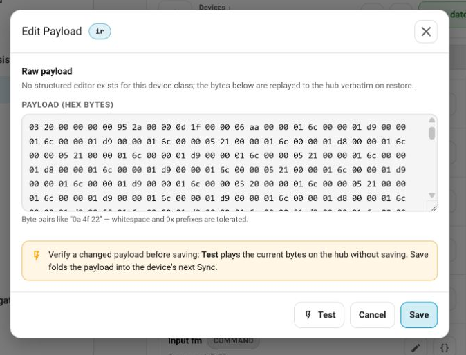

# IrScrutinizer Exporters For Sofabaton Command Payloads

This directory contains custom IrScrutinizer export formats for generating
payload-ready output for the Sofabaton Home Assistant integration.

These exporters are intended to bridge two worlds:

- IrScrutinizer, which can import, decode, analyze, and render IR signals from local, physical or online sources
- the Sofabaton integration's **command payload** workflow, where users test
  and save IR command payloads to the hub

If you are new to command payloads, read
[../docs/command_payloads.md](../docs/command_payloads.md) first.

With these exporters users convert IR signals into Sofabaton hub-compatible command payloads.

> ⚠️ **Re-export required for older payloads.** Versions of `sofabaton-x.xml`
> before the 2026-08-31 layout fix emitted an incorrect byte layout. The hub
> **accepts** those payloads without an error, but **emits no IR** when the
> command runs. Old exports are easy to spot: the payload begins with
> `00 00 03 20 00 00`. If any of your saved `.sbx` payloads start with those
> bytes, update the exporter and re-export them. A payload only counts as
> working when the target device physically responds; a successful Test send
> alone proves nothing.

## ◇ Files in this directory

- [sofabaton-x.xml](sofabaton-x.xml)
  exports the raw timing-style Sofabaton IR payload used by all X-series hubs.
- [sofabaton-x2.xml](sofabaton-x2.xml)
  exports the X2's descriptive ASCII form, such as
  `P:Sony12 R:40000 D:1 F:18 MUL:2`.
- [x2-protocols.md](x2-protocols.md)
  is a maintainer note with current protocol validation status for the X2
  exporter.

## ◇ Limitations

There are 2 ways that a Sofabaton hub stores IR command payloads:

- The **raw IR format** describes the signal by its actual transmitted timings: carrier frequency plus the sequence of mark/space durations. It is a low-level recording of what the hub should send. The **raw IR format** is supported on **all hubs**.
- The **descriptive format** describes the same signal by its decoded protocol and parameter values, like `P:Sony12 R:40000 D:1 F:18 MUL:2`. It is a higher-level, human-readable representation of what the signal means. The **descriptive format** is supported on the **X2 hub only**.

The descriptive format requires an IR Protocol identifier. Making a mistake there will render the payload useless.  
The raw format needs no protocol knowledge at all: its header is just a declared timing length, a format field, and the carrier frequency, followed by the timing words themselves.
What that means for these exporters:

- The raw format exporter is protocol agnostic and should handle any signal IrScrutinizer can render as raw timings. If you're interested in the exact byte layout, open the exporter in a text editor.
- The descriptive exporter implements a mapping between Protocol naming conventions of the Sofabaton hub and those used in IrScrutinizer, and generates checksums when required. This mapping is incomplete! A fair amount of protocols have been mapped, but certainly this is not exhaustive.

All known IR commands can be converted into Sofabaton compatible payloads, it is a matter of mapping protocol labels.

## ◇ Installation

- Download and install [IrScrutinizer](https://github.com/bengtmartensson/IrScrutinizer).
  Grab the installer for your platform from [this page](https://github.com/bengtmartensson/IrScrutinizer/releases).

- Once IrScrutinizer is installed:
  1. Copy `sofabaton-x.xml` and/or `sofabaton-x2.xml` into IrScrutinizer's
     `exportformats.d` folder.
  2. Restart IrScrutinizer, or in the app select:
     `Options -> Export formats database -> Reload`
  3. Open the **Export** pane and look for the new formats:
  - `Sofabaton X-series`
  - `Sofabaton X2`

## ◇ What the exporters produce

### `Sofabaton X-series`

This exporter emits a single raw Sofabaton IR payload as a hex string with
spaces between bytes.

The current implementation:

- declares the timing-section byte length as a 2-byte big-endian integer
  (4 bytes per `flash`/`gap` duration; the terminator is not counted)
- writes a 4-byte format field: `00 00 00 00`
- writes the carrier frequency as a 2-byte big-endian integer in Hz
- writes every `flash` and `gap` duration as 4-byte big-endian microseconds
- preserves the signal structure already present in Girr:
  intro, repeat, and ending are emitted in order
- terminates with `00 00 00 00`

This layout was validated on 2026-08-31 by a physically observed device
response (a Samsung TV driven through an X1 hub) and matches vendor-cloud
command deploys fetched back from a hub. Earlier versions of this exporter
used a different framing (a fixed `00 00 03 20 00 00` header plus a 4-byte
carrier) that the hub accepted but never emitted; see the warning at the top
of this document.

This format is intended for:

- X1 / X1S / X2 hubs

### `Sofabaton X2`

This exporter emits the X2's descriptive ASCII payload form, for example:

```text
P:Sony12 R:40000 D:1 F:18 MUL:2
```

This format is intended for:

- X2 hubs

## ◇ Example workflow

This is the practical path that leads to a usable command payload in Home Assistant.

In the **Export** tab, select the X-series exporter.  


In the **Import** tab, use the **RemoteLocator** to find an online source for your device.  
Click "Select me to load" to load the list of Manufacturers.  


Find your device and click the **Load** button.  


After clicking **Load** the list of commands appears.  


Find the command you intend to export, right-click it and select **Scrutinize Selected**.  


Now go to the **Scrutinize signal** tab. And click **Export**.  


The exported file is saved in the directory configured in the Export tab. Open it in Notepad to see the payload.  


Copy the payload into the Control Panel card -> Hub tab -> Edit device -> command payload editor. Click the **Test** button.  

