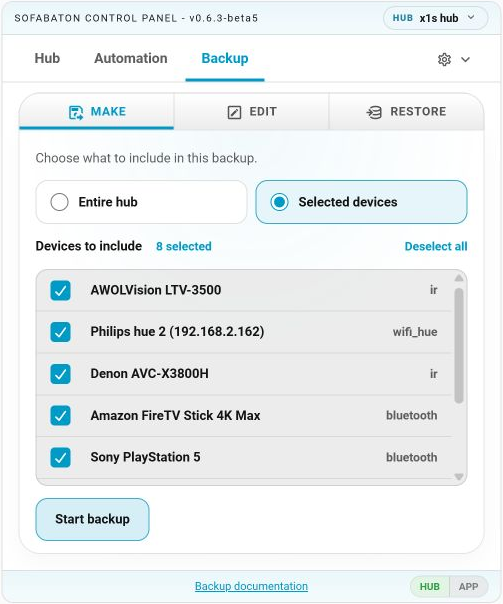

# Sofabaton Backup and Restore

The **Backup** tab in the **Sofabaton Control Panel** can create, edit, and
restore local JSON backup files.

A backup contains hub configuration: Devices, Activities, commands and their
payloads, inputs, power sequences, button assignments, shortcuts, macros,
ordering, and related metadata. It does not capture runtime state such as which
Activity was running or whether a Device was powered on.

## Before you start

- **Persistent cache must be enabled to make a backup.** The card uses the
  cached hub catalog to offer the available Devices and Activities.
- Backup, restore, and hub editing are unavailable while the Sofabaton app or
  another hub operation holds the connection.
- Keep the downloaded JSON file somewhere safe. The integration does not
  maintain a backup archive for you.

## Make a backup

Open **Backup → Make** and choose a scope:

- **Entire hub** — includes every Device and Activity.
- **Selected devices** — includes only the Devices you select and no
  Activities.

Use **Entire hub** if you may need to restore Activities later. Activities
depend on Devices and commands, so a complete hub backup is the safest recovery
point. Selected-Device backups are useful for archiving or copying individual
Devices.

Choose **Start backup** and follow the progress in the card. The job runs in the
integration backend, so it continues if you close the card or navigate elsewhere
in Home Assistant. Returning to the card reconnects to the active operation.

When the backup is ready, download it within **5 minutes**. That limit applies
only to the integration's temporary copy; the JSON file you downloaded does not
expire. If the temporary copy expires, create another backup.

## Edit a backup

Open **Backup → Edit** and choose a backup file. Editing works on an in-memory
copy and does not change the hub.

| Area | What you can edit |
| --- | --- |
| Hub | Hub name and the order of Devices and Activities |
| Activities | Name, participating Devices, inputs, power sequences, button groups and bindings, shortcuts, and macros |
| Devices | Name, automatic power behavior, power sequences, commands and payloads, button bindings, and supported Wifi IP settings |

You can also remove Activities, Devices, commands, shortcuts, and macros. The
editor shows affected references and clears them from the loaded backup where
needed.

Choose **Download edited backup** to save your changes to a new JSON file.
Editing does not modify the original backup file or the hub.

> Deletions and a changed hub name reach the destination hub only through an
> erase-and-restore operation. A normal merge restore does not remove existing
> hub content.

For command payload fields and formats, see the
[command payload guide](command_payloads.md).

## Restore a backup

1. Open **Backup → Restore** and choose a full backup JSON file.
2. Select the Activities and Devices to restore.
3. Leave **Erase existing Devices and Activities** off for a merge, or enable it
   for a clean replacement.
4. Choose **Start restore** and follow the progress in the card.

Selecting an Activity automatically includes the Devices and linked Activities
it depends on.

### Merge restore

Merge is the default. It adds the selected backup content alongside what is
already on the destination hub. Use it to import individual Devices or add
content without erasing the current configuration.

### Erase and restore

Enabling **Erase existing Devices and Activities** erases the entire destination
hub before restoring the selected items. Use it when you want a clean rebuild.

Be careful when restoring only a subset: the hub is still erased first, and
only the selected backup items are then restored. The saved hub name is also
applied only in this mode.

Devices are restored before Activities. Activity references are remapped to the
new Device ids assigned by the destination hub.

## Compatibility

The source hub model is stored in the backup. Restoring to the same model or a
newer model is supported; restoring to an older model is blocked.

| Backup source | Supported destination hubs |
| --- | --- |
| X1 | X1, X1S, X2 |
| X1S | X1S, X2 |
| X2 | X2 |

This compares the hub model family, not its firmware build number.

Restore also requires the exact backup schema version supported by the installed
integration. Older or newer schema versions are rejected; there is no automatic
migration. Only full backup bundles can be edited or restored—structural cache
bundles do not contain command payloads and are rejected.

## Failure behavior

If an erase fails, restore stops before writing backup content. Once Device or
Activity restoration has begun, however, there is no automatic rollback. If a
later step fails, anything already restored remains on the hub and the progress
result identifies where the failure occurred.

Keep the source backup until you have verified the restored hub. After a partial
failure, you can retry the missing content or run an erase-and-restore again for
a clean rebuild.

## Advanced JSON editing

The card editor is the recommended way to modify a backup. Manual JSON editing
is possible, but changing ids, required fields, or the bundle structure can make
the file invalid.

Command payloads use `restore_data.data_hex` and, when supported, a structured
`restore_data.decoded` block. See the
[command payload guide](command_payloads.md#payloads-in-backups) before editing
those fields by hand.

## Related documentation

- [Command payloads](command_payloads.md)
- [Home Assistant Action reference](actions.md)
