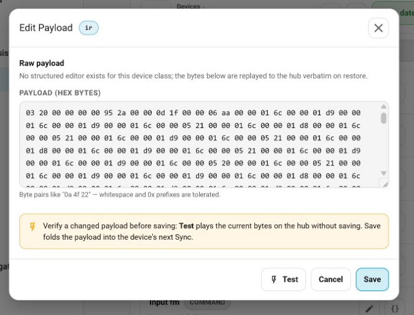

# Sofabaton Command Payloads

A command payload is the data the hub sends when a command runs. Most users
never need to edit it, but payload editing is useful for testing IR codes,
adding commands, sharing codes, and correcting Wifi command details.

> **Terminology:** Command payloads were previously called **blobs**. That name
> remains in the advanced Home Assistant Action names and their `blob` fields,
> but the Control Panel and this documentation use **command payload**.

## Edit an existing command

In the **Sofabaton Control Panel**, open **Hub → Devices**, select a Device, and
choose **Edit device**. Under **Commands**:

- use the pencil to rename a command;
- use the braces (`{}`) to fetch and edit its payload.

The payload is fetched from the hub only when you open the editor. Recognized
payloads get a structured form; everything else is shown as raw hexadecimal
bytes.

1. Make the required change.
2. For an IR Device, use **Test** to send the current payload once without
   saving it.
3. Choose **Save** to stage the change in the Device editor.
4. Review the pending changes and choose **Sync** to write them to the hub.

> **Test**, **Save**, and **Sync** are separate steps. Test never saves. Save
> does not change the hub until the Device is synced.

## Add a command

Choose **Add command** in the Device editor, then enter a name and payload.
The form depends on the Device class:

- **IR** — enter a descriptive payload beginning with `P:`, such as
  `P:Sony12 R:40000 D:1 F:18 MUL:2`. You can Test it before saving.
- **Supported Wifi classes** — edit the structured fields. The editor uses an
  existing command from that Device as a template for the hub-specific record.
- **Other classes** — enter raw hex. A non-IR Device needs at least one existing
  command so the integration can reuse its command metadata.

The new command is staged alongside the other Device edits and created during
the next Sync.

## Payload forms

### Raw payloads

Raw payloads are shown as hex byte pairs. Whitespace and `0x` prefixes are
accepted; the editor normalizes the formatting without trying to interpret the
payload's fields.

For IR, raw payloads commonly contain carrier frequency and timing data from a
learned signal or an IR database. Raw IR works across X1, X1S, and X2 hubs.

### Structured payloads

When the integration recognizes a payload, the editor exposes its useful fields
instead of making you edit the encoded bytes directly:

| Class | Editable fields |
| --- | --- |
| `ir` | Descriptive IR string beginning with `P:` |
| `wifi_ip` | Host, port, method, path, headers, content type, and body |
| `wifi_roku` | Command path |
| `wifi_hue` | Path and request body |
| `wifi_sonos` | Path and request body |

Payloads without a supported decoder remain available as raw hex. A readable
form is a convenience, not a requirement for a valid command.

The Control Panel can synthesize, Test, and save descriptive IR commands on X1,
X1S, and X2 hubs. The raw IrScrutinizer exporter remains the most portable
choice when you want timing-style payloads.

## Obtain and share IR payloads

You can use:

- a payload fetched from another command on your hub;
- a payload shared by another user;
- IR data converted from an online database with
  [IrScrutinizer](../IrScrutinizer/README.md).

For an imported payload, paste it into the editor, Test it, Save it, and then
Sync the Device. When sharing a payload, include the Device brand and model,
the command's purpose, and whether the payload was learned, generated, or taken
from a database.

## Payloads in backups

Full backups contain command payloads and can be edited offline through
**Backup → Edit**. Structural cache bundles do not contain payloads and cannot
be restored or edited as backups.

In backup JSON, `restore_data.data_hex` contains the stored bytes. Some commands
also have a human-readable `restore_data.decoded` block. When editing JSON by
hand, change only `decoded.fields`, set `decoded.edited` to `true`, and leave
`decoded.class` and `decoded.trailer_hex` unchanged. If `edited` is absent or
false, restore uses the original `data_hex`.

See the [backup and restore guide](backup.md) for the complete backup workflow.

## Advanced Home Assistant Actions

The legacy Action names still use *blob*:

| Action | Purpose |
| --- | --- |
| `sofabaton_x1s.fetch_blob` | Fetch a command payload from the hub |
| `sofabaton_x1s.play_ir_blob` | Test an IR payload without saving it |
| `sofabaton_x1s.persist_ir_blob` | Add an IR command directly to an existing IR Device |

These Actions are useful in scripts and automations, but the Control Panel is
the simpler interactive workflow. See the [Action reference](actions.md) for
fields, response data, and examples.

## Important notes

- **Test is available only for IR Devices.** Payload editing and saving also
  support other Device classes.
- A payload Save in the live editor is staged; use the Device's **Sync** button
  to write it to the hub.
- Test an IR payload before syncing it whenever possible.
- Editing and syncing are unavailable while the Sofabaton app or another hub
  operation holds the connection.
- If the editor asks for a cache refresh, refresh that Device and reopen it.
- Not every payload has a readable structured form; raw-only is normal.
