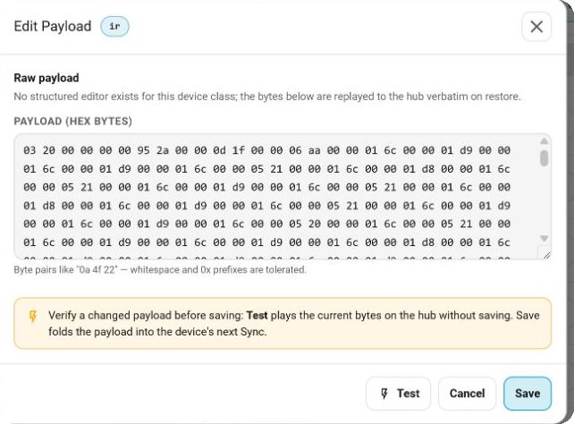

# Sofabaton Command Payloads

A command payload is the data the hub sends when a command runs. Most users
never need to edit it, but payload editing is useful for testing IR codes,
adding commands, sharing codes, and correcting Wifi command details.

> **Terminology:** Command payloads were previously called **blobs**. That name
> remains in the advanced Home Assistant Action names and their `blob` fields,
> but the Control Panel and this documentation use **command payload**.

## ◇ Edit an existing command

Open **Sofabaton X → Control Panel** from the [sidebar](sidebar.md) (0.7.0),
or use the dashboard Control Panel card. Go to **Hub → Devices**, select a
Device, and choose **Edit device**. Under **Commands**:

- use the pencil to rename a command;
- use the braces (`{}`) to fetch and edit its payload;
- use the trash can to remove a command.

The payload is fetched from the hub only when you open the editor. Recognized
payloads get a structured form; everything else is shown as raw hexadecimal
bytes.

1. Make the required change.
2. For an IR Device, use **Test** to send the current payload once without
   saving it.
3. Choose **Save** to stage the change in the Device editor.
4. Review the pending changes and choose **Sync** to write them to the hub.

> **Test**, **Save**, and **Sync** are separate steps. Test never saves. Save
> does not change the hub until the Device is synced.

## ◇ Add a command

Choose **Add command** in the Device editor, then enter a name and payload.
The form depends on the Device class:

- **IR** — paste Pronto Hex or Sofabaton Hex, or use **Learn** to capture the
  code (see below). On **X2 hubs only**, you can also enter a descriptive
  payload beginning with `P:`, such as `P:Sony12 R:40000 D:1 F:18 MUL:2`.
  You can Test it before saving.
- **Supported Wifi classes** — edit the structured fields. The editor uses an
  existing command from that Device as a template for the hub-specific record.
  For MQTT, changing the payload's IDs does not change the IDs the hub publishes.
- **Other classes** — enter raw hex. A non-IR Device needs at least one existing
  command so the integration can reuse its command metadata.

The new command is staged alongside the other Device edits and created during
the next Sync.

## ◇ Remove a command

Choose the trash can next to a command in the Device editor. The confirmation
lists the favorites, button assignments, and sequence steps that use the
command. Removal is staged like any other Device edit: review the pending
changes and choose **Sync** to delete the command from the hub.

Deleting a command also removes its references on the hub, and the order of
the remaining commands is updated. A button that was assigned to the command
is left unassigned, so reassign it afterwards if you still need it.

Devices managed by **Wifi Commands** are the exception: their commands are
read-only in the Device editor and are removed under
**Automation → Wifi Commands** instead. See the
[remote and hub trigger guide](wifi_commands.md).

## ◇ Learn a payload

For IR Devices the payload editor has a **Learn** button next to the format
tabs. It offers up to two sources:

- **From a remote.** The hub's own IR receiver is armed for one button press.
  Point the physical remote at the hub and press the button once; the captured
  code drops straight into the editor. The hub keeps its receiver armed for
  about a minute, and any other hub traffic (a press on the paired Sofabaton
  remote, an automation sending a command) ends the window early. Leaving the
  editor cancels it.
- **From Home Assistant.** Shown only when another integration uses the hub's
  infrared emitter (a Samsung or LG Infrared remote, an IR air conditioner, and
  so on) or the emitter has sent something before. Everything those
  integrations send through the hub is collected in an inbox, newest first.
  Send the command from wherever you normally would in Home Assistant, come
  back, and pick it. Nothing has to stay open while you do this: the inbox
  lives on the hub side, survives page changes, and keeps the last twenty
  distinct codes. This is the only way to capture codes that are generated on
  the fly, such as air-conditioner state frames.

Either way the code lands as Sofabaton Hex with its Pronto Hex view alongside.
Test it, then Save; the command is written to the hub on the next Sync.

## ◇ Payload forms

### Raw payloads

Raw payloads are shown as hex byte pairs. Whitespace and `0x` prefixes are
accepted; the editor normalizes the formatting without trying to interpret the
payload's fields.

For IR, raw payloads commonly contain carrier frequency and timing data from a
learned signal or an IR database. Raw IR works across X1, X1S, and X2 hubs.

### Structured payloads

When the integration recognizes a payload, the editor shows its fields in a
structured form:

| Class        | Structured fields                                           |
| ------------ | ----------------------------------------------------------- |
| `ir`         | Descriptive IR string beginning with `P:` (X2 hubs only)    |
| `wifi_ip`    | Host, port, method, path, headers, content type, and body   |
| `wifi_roku`  | Command path                                                |
| `wifi_hue`   | Path and request body                                       |
| `wifi_sonos` | Path and request body                                       |
| `wifi_mqtt`  | Device ID and command ID (ignored by the hub; X2 hubs only) |

The two IDs stored in an MQTT command payload can be written, but the hub
ignores their values. When the command runs, it publishes the actual device
and command IDs to the broker (as `device_id` and `key_id`). Changing the
payload's IDs does not change that message. There are no topic, broker, QoS,
or retain settings in the command payload.

Payloads without a supported decoder remain available as raw hex. A readable
form is a convenience, not a requirement for a valid command.

Descriptive IR commands are supported on **X2 hubs only**. The Control Panel
rejects descriptive payloads beginning with `P:` on X1 and X1S hubs. For those
hubs, use raw timing payloads, entered as Pronto Hex or Sofabaton Hex, or
captured with **Learn**. The raw IrScrutinizer exporter produces timing-style
payloads for X1, X1S, and X2 hubs.

## ◇ Obtain and share IR payloads

You can use:

- a code learned from a physical remote or captured from another integration
  (see **Learn a payload** above);
- a payload fetched from another command on your hub;
- a payload shared by another user;
- a code exported from an Unfolded Circle remote (see below);
- IR data converted from an online database with
  [IrScrutinizer](../IrScrutinizer/README.md).

### Unfolded Circle codes

Unfolded Circle remotes store IR commands as either `PRONTO` codes or `HEX`
codes such as `3;0x4B36D32C;32;0` (protocol, value, bit count, repeat count).
Paste either form into the payload editor, or paste a whole row of a codeset
CSV export such as `"Power-Toggle","HEX","3;0x4B36D32C;32;0"`. PRONTO codes
are used as they are. HEX codes are rendered by Home Assistant's
`infrared-protocols` library into timings and shown as Pronto Hex; the editor
does not keep the original HEX text. When a row is pasted while adding a
command, its name fills the Name field if that is still empty.

Only protocols with an encoder in `infrared-protocols` convert: NEC, Sony,
Samsung, RC5, RC6, Panasonic, Sharp, and Pioneer. Other protocols are refused
with a message that names the protocol; export those commands as PRONTO from
the Unfolded Circle web configurator instead. A HEX code's embedded repeat
count is applied where the protocol has a repeat form.

> **Note:** payloads exported with the Sofabaton X-series IrScrutinizer
> exporter before its 2026-08-31 layout fix are accepted by the hub but emit
> no IR. They start with `00 00 03 20 00 00`; re-export them with the fixed
> exporter. See the [exporter README](../IrScrutinizer/README.md) for details.

For an imported payload, paste it into the editor, Test it, Save it, and then
Sync the Device. When sharing a payload, include the Device brand and model,
the command's purpose, and whether the payload was learned, generated, or taken
from a database.

## ◇ Payloads in backups

Full backups contain command payloads and can be edited offline through
**Backup → Edit**. Structural cache bundles do not contain payloads and cannot
be restored or edited as backups.

In backup JSON, `restore_data.data_hex` contains the stored bytes. Some commands
also have a human-readable `restore_data.decoded` block. When editing JSON by
hand, change only `decoded.fields`, set `decoded.edited` to `true`, and leave
`decoded.class` and `decoded.trailer_hex` unchanged. If `edited` is absent or
false, restore uses the original `data_hex`.

See the [backup and restore guide](backup.md) for the complete backup workflow.

## ◇ Advanced Home Assistant Actions

The legacy Action names still use _blob_:

| Action                          | Purpose                                             |
| ------------------------------- | --------------------------------------------------- |
| `sofabaton_x1s.fetch_blob`      | Fetch a command payload from the hub                |
| `sofabaton_x1s.play_ir_blob`    | Test an IR payload without saving it                |
| `sofabaton_x1s.persist_ir_blob` | Add an IR command directly to an existing IR Device |

These Actions are useful in scripts and automations, but the Control Panel is
the simpler interactive workflow. See the [Action reference](actions.md) for
fields, response data, and examples.

## ◇ Important notes

- **Test is available only for IR Devices.** Payload editing and saving also
  support other Device classes.
- A payload Save in the live editor is staged; use the Device's **Sync** button
  to write it to the hub.
- Test an IR payload before syncing it whenever possible, and confirm the
  target device actually reacts. The hub accepts a malformed IR payload
  without any error and then emits nothing, so a Test that "succeeds" in the
  editor is not proof of IR output.
- Editing and syncing are unavailable while the Sofabaton app or another hub
  operation holds the connection.
- If the editor asks for a cache refresh, use **Refresh all** in the prompt
  or on the **Hub** tab, and wait for it to finish. The prompt reloads the
  editor automatically; if you refreshed from the Hub tab, reopen the Device
  editor. This refreshes Device settings and Activity references together.
  A single-Device refresh loads that Device's full structural details, but
  does not refresh Activities that reference it, so it may not resolve every
  cache-related editing or Sync block.
- Not every payload has a readable structured form; raw-only is normal.
