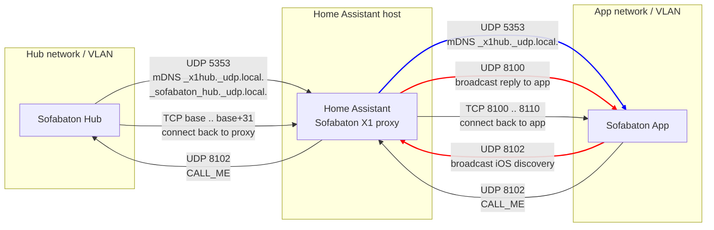

# Networking guide

This integration acts as a proxy between your Sofabaton hub(s) and the official app. The network path is split in two segments so you can size firewall rules and container interfaces correctly.


```markdown
RED ARROWS   : You need these for your Sofabaton iOS app
BLUE ARROW   : You need this for your Sofabaton Android app
BLACK ARROWS : Needed for everybody
```
## Segment 1 – Hub ↔ Integration

The integration discovers the physical hub and then keeps a bidirectional session open.

### Discovery
- Uses mDNS/Bonjour for the `_x1hub._udp.local.` (X1 and X1S) or `_sofabaton_hub._udp.local.` (X2) advertisement to learn the hub IP/UDP port.
- If hubs sit on a different VLAN, multicast must be forwarded or you need to add the hub manually in the config flow (IP + UDP port).
  When rebroadcasting mDNS across VLANs, an issue may be encountered due to the X2 hub advertising a non-conformant Service Name. The name "sofabaton_hub" is explicitly dissallowed in mDNS standard RFC 6335 (Section 5.1 explicitly states: "The service name... MUST NOT contain underscores."). mDNS libraries like Zeroconf will not be able to rebroadcast as newer versions strictly implement the standard. To work around this, rebroadcast as `_x1hub._udp.local.`, integration and app will then work as intended. The integration itself also follows this strategy.

### Connect flow
1. **CALL_ME over UDP**: Home Assistant sends a short "call me" packet to the hub's advertised UDP port (usually `8102`).
2. **TCP connect-back**: The hub opens a TCP session back to Home Assistant on the proxy's listen port. The integration tries up to 32 sequential TCP ports starting from the configured base port, so multiple hubs can coexist without clashes.

### Firewall rules to allow
- mDNS/Bonjour from hub → Home Assistant (or mDNS forwarded across VLANs).
- UDP from Home Assistant → hub on the Sofabaton UDP port (`8102` by default).
- TCP from hub → Home Assistant on the proxy listen range (the configured base port plus up to 31 additional ports for other hubs).

If discovery works but the integration never shows the hub as connected, the TCP connect-back from the hub to Home Assistant is usually being blocked.

## Segment 2 – Integration ↔ Official app (proxy)

### Discovery (app side)
Two discovery mechanisms run in parallel:

1. **iOS-specific (UDP broadcast):**
   - The app sends a UDP broadcast to listeners on port **8102**.
   - The integration responds with its own UDP broadcast on port **8100** so the app learns the proxy details.
2. **Cross-platform (mDNS/Bonjour):**
   - For Android and other platforms, the app uses mDNS to find the advertised `_x1hub._udp.local.` proxy record.

Keep the proxy UDP listener on **8102** to satisfy the iOS discovery flow. Android can discover on other ports, but iOS discovery is lost if you move away from 8102.


> ⚠️ iOS discovery and VLANs
> 
> The iOS app’s discovery uses **UDP broadcast** on port 8102. By default, routers do **not**
> forward broadcasts across VLANs/subnets, even if normal unicast traffic (HTTP, TCP, etc.)
> works fine between them. This means:
> 
> - If the app and Home Assistant live on different VLANs with only normal routing, iOS
>   broadcast discovery will *not* reach the proxy.
> - To keep them on different VLANs *and* have iOS discovery work, you need a **UDP
>   broadcast relay** between the VLANs (many router firmwares like OpenWRT, pfSense, etc.
>   can do this), or you must rely on manual configuration (although that supports only a single hub)
> - Once discovery is done, all further communication is unicast UDP and TCP and will happily
>   traverse your routed VLANs.


### Connect flow (app side)
1. **CALL_ME from app → proxy (UDP):** the app sends a call-me packet to the proxy listener once discovery completes (on the configured UDP listening port, **8102** by default).
2. **TCP connect-back from proxy → app:** after the call-me, the proxy opens a TCP connection into the app on a port in the **8100–8110** range that the app exposes.
3. **Relay to the real hub:** once the TCP session is up, the proxy bridges app commands to the already-established hub connection.

When the app is connected, command-sending entities in Home Assistant intentionally become unavailable to avoid conflicting control writers.

### Firewall and container tips
- Allow UDP from the app network/VLAN to Home Assistant on the proxy UDP port (ideally 8102 for iOS support). The proxy must be able to send and receive both unicast and **broadcast** UDP on that port (broadcast for iOS discovery).
- Allow TCP **outbound from Home Assistant to the app** on the port range **8100–8110**. This directionality is important: the proxy calls back into the app after the call-me, not the other way around.
- Allow the app to use UDP (unicast and broadcast) and TCP within **8100–8110** toward Home Assistant so it can send the call-me and handle the connect-back. Broadcast is only required for iOS compatibility.
- If Home Assistant runs in a container, bind the proxy UDP/TCP ports to the host interfaces that your mobile devices can reach.

## Multiple hubs and VLANs checklist
- Ensure each hub's mDNS traffic reaches Home Assistant (multicast forwarding or manual configuration).
- Reserve a contiguous TCP port range large enough for your hubs (base port + up to 31). Avoid collisions with other services on the host.
- If you split hubs and apps across VLANs:
  - For Android / mDNS-based discovery, make sure multicast is forwarded (e.g. mDNS
    reflector) and UDP/TCP paths are allowed.
    Rebroadcasting the physical X2 hub's advertisement may not work in some cases, as the Service Name is not standards compliant. Rebroadcast as `_x1hub._udp.local` as a workaround.
  - For **iOS broadcast discovery**, either keep the app and Home Assistant in the same
    VLAN/broadcast domain or run a UDP broadcast relay between VLANs. Plain inter-VLAN
    routing is not enough for broadcast traffic.
- Keep the proxy UDP listener on 8102 whenever iOS discovery is required.

## Troubleshooting
- **Seen in discovery but never connects:** likely missing TCP allow rule from hub to Home Assistant.
- **No discovery across VLANs:** forward mDNS or configure the hub manually.
- **App cannot find the proxy:** confirm the proxy UDP port is reachable (and set to 8102 for iOS).
- **Port already in use:** pick a different TCP base port; the integration will try the next 31 ports automatically.
- **iOS app can’t discover across VLANs but manual connections work:** this is expected
  without a UDP broadcast relay. iOS discovery uses broadcast, which does not cross VLAN
  boundaries by default.

## For the road
```
| From          | To            | Protocol | Port(s)              | Used for                                      | Needed for                            |
|---------------|---------------|----------|----------------------|-----------------------------------------------|---------------------------------------|
| Hub network   | HA host       | UDP      | 5353                 | mDNS `_x1hub._udp.local.` hub advert.         | Hub discovery by integration for X1(S)|
| Hub network   | HA host       | UDP      | 5353                 | mDNS `_sofabaton_hub._udp.local.` hub advert. | Hub discovery by integration for X2   |
| HA host       | Hub network   | UDP      | 8102                 | `CALL_ME` from proxy to hub                   | Hub connect flow                      |
| Hub network   | HA host       | TCP      | base .. base+31      | Hub connects back to proxy                    | Hub control and status                |
| HA host       | App network   | UDP      | 5353                 | mDNS `_x1hub._udp.local.` to app              | Sofabaton Android app (blue arrow)    |
| App network   | HA host       | UDP      | 8102                 | iOS broadcast discovery to proxy              | Sofabaton iOS app (red arrow)         |
| HA host       | App network   | UDP      | 8100                 | iOS broadcast reply from proxy                | Sofabaton iOS app (red arrow)         |
| App network   | HA host       | UDP      | 8102                 | `CALL_ME` from app to proxy                   | iOS and Android app                   |
| HA host       | App network   | TCP      | 8100–8110            | Proxy connects back to app                    | iOS and Android app                   |
```
