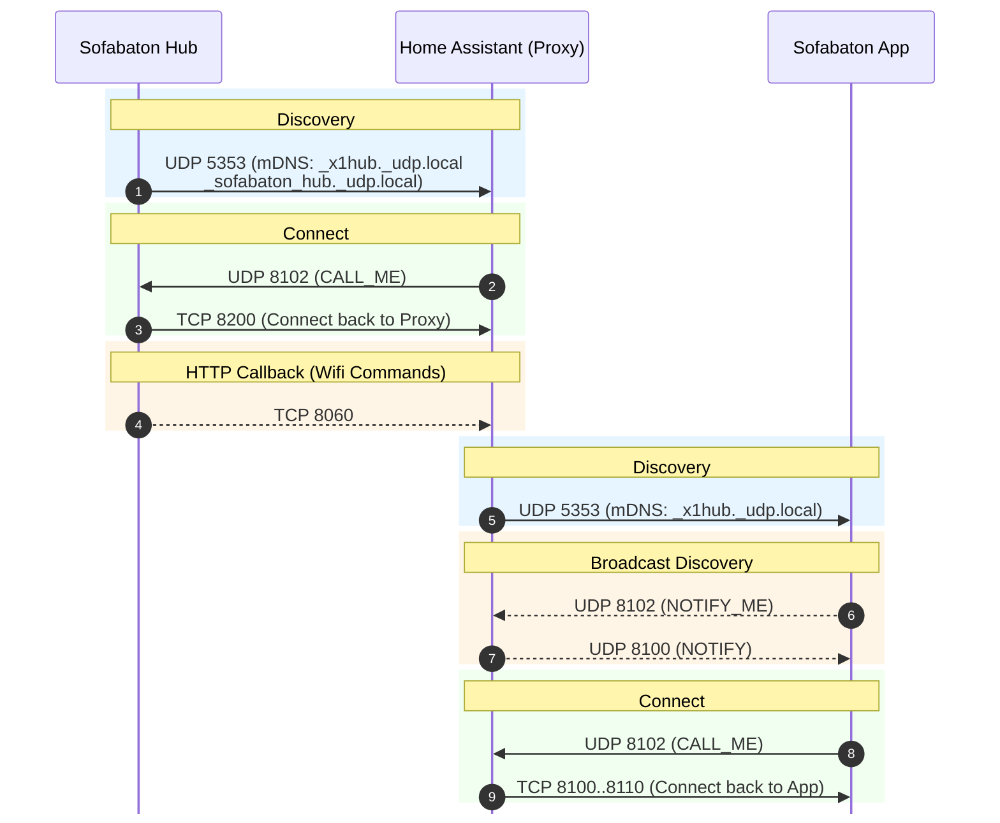

# Networking guide

This integration acts as a proxy between your Sofabaton hub(s) and the official app. The network path is split in two segments so you can size firewall rules and container interfaces correctly.

```mermaid
%%{init: { 'theme': 'default', 'sequence': { 'messageMargin': 10, 'boxMargin': 5, 'noteMargin': 5, 'mirrorActors': false }}}%%
sequenceDiagram
    autonumber
    participant Hub as Sofabaton Hub
    participant HA as Home Assistant (Proxy)
    participant App as Sofabaton App

    rect rgb(230, 245, 255)
        Note over Hub, HA: Discovery
        Hub->>HA: UDP 5353 (mDNS: _x1hub._udp.local <br/> _sofabaton_hub._udp.local)
    end

    rect rgb(240, 255, 240)
        Note over Hub, HA: Connect
        HA->>Hub: UDP 8102 (CALL_ME)
        Hub->>HA: TCP 8200 (Connect back to Proxy)
    end

    rect rgb(255, 245, 230)
        Note over Hub, HA: HTTP Callback (Wifi Commands)
        Hub-->>HA: TCP 8060
    end

    rect rgb(230, 245, 255)
        Note over HA, App: Discovery
        HA->>App: UDP 5353 (mDNS: _x1hub._udp.local)
    end

    rect rgb(255, 245, 230)
        Note over App, HA: Broadcast Discovery
        App-->>HA: UDP 8102 (NOTIFY_ME)
        HA-->>App: UDP 8100 (NOTIFY)
    end

    rect rgb(240, 255, 240)
        Note over App, HA: Connect
        App->>HA: UDP 8102 (CALL_ME)
        HA->>App: TCP 8100..8110 (Connect back to App)
    end
```

> Broadcast Discovery is optional for Android clients.  
> HTTP callbacks / Wifi Commands are optional.

## Security / listener model

The listener ports are intended for a trusted local network, not for exposure to the public internet. The Sofabaton hub protocol and the Wifi Commands callback format do not provide TLS or user authentication, so the network boundary is your router, VLAN, container publishing rules, and host firewall.

The integration still applies narrow application-level filtering:

- The hub TCP connect-back listener binds to all interfaces on the configured port so real hubs can reach Home Assistant across normal LAN and VLAN layouts. Accepted sockets are dispatched by the connecting hub IP; connections from unknown IPs are dropped.
- The Wifi Commands HTTP listener is only started while an enabled hub still has deployed callback commands. It accepts only small, Roku-style `POST /launch/...` requests, rejects oversized or malformed requests, matches the per-hub action id in the path, and rejects requests from IPs other than the configured hub IP when that IP is known.
- The app-side proxy listener is for the official Sofabaton app discovery and connect-back flow. Keep it reachable only from networks where you want the app to discover or control the proxy.

Recommended deployment: allow the exact hub/app networks listed below, avoid publishing these ports through reverse proxies or internet-facing NAT, and prefer VLAN/firewall rules over relying on the listeners as a security boundary.

## Segment 1 – Hub ↔ Integration

The integration discovers the physical hub and then keeps a bidirectional session open.

### Discovery

- Uses mDNS/Bonjour for the `_x1hub._udp.local.` (X1 and X1S) or `_sofabaton_hub._udp.local.` (X2) advertisement to learn the hub IP/UDP port.
- If hubs sit on a different VLAN, multicast must be forwarded or you need to add the hub manually in the config flow (IP + UDP port).

> ⚠️ When rebroadcasting mDNS across VLANs, an issue may be encountered due to the X2 hub advertising a non-conformant Service Name. The name "sofabaton_hub" is explicitly disallowed in mDNS standard RFC 6335 (Section 5.1). mDNS libraries like Zeroconf will not be able to rebroadcast as newer versions strictly implement the standard. To work around this, rebroadcast as `_x1hub._udp.local.`, integration and app will then work as intended. The integration itself also follows this strategy.

### Connect flow

1. **CALL_ME over UDP**: Home Assistant sends a short "call me" packet to the hub's advertised UDP port (usually `8102`).
2. **TCP connect-back**: The hub opens a TCP session back to Home Assistant on the proxy's listen port (8200 by default). All configured hubs share the same listener; the proxy dispatches each accepted connection to the right hub by peer IP.

### Optional / Wifi Commands

When using this integration's "[Wifi Commands](wifi_commands.md)" feature, the hub will make HTTP requests into the integration. The default port used is **8060**. The port is configurable in the integration's global options, but changing it breaks compatibility with X1 hubs.

### Firewall rules to allow

- mDNS/Bonjour from hub → Home Assistant (or mDNS forwarded across VLANs).
- UDP from Home Assistant → hub on the Sofabaton UDP port (`8102` by default).
- TCP from hub → Home Assistant on the proxy listen port (8200 by default), shared by all configured hubs.

If discovery works but the integration never shows the hub as connected, the TCP connect-back from the hub to Home Assistant is usually being blocked.

## Segment 2 – Integration ↔ Official app (proxy)

### Discovery (app side)

Two discovery mechanisms run in parallel:

1. **iOS-specific (UDP broadcast):**
   - The app sends a UDP broadcast to listeners on port **8102**.
   - The integration responds with its own UDP broadcast on port **8100** so the app learns the proxy details.
2. **Cross-platform (mDNS/Bonjour):**
   - For Android and other platforms, the app uses mDNS to find the advertised `_x1hub._udp.local.` proxy record.

Keep the proxy UDP listener on **8102** to satisfy the iOS discovery flow. Android can discover on other ports, but iOS discovery is lost if you move away from 8102.

> ⚠️ **iOS discovery and VLANs**
>
> The iOS app’s discovery uses **UDP broadcast** on port 8102. By default, routers do **not**
> forward broadcasts across VLANs/subnets, even if normal unicast traffic (HTTP, TCP, etc.)
> works fine between them. This means:
>
> - If the app and Home Assistant live on different VLANs with only normal routing, iOS
>   broadcast discovery will _not_ reach the proxy.
> - To keep them on different VLANs _and_ have iOS discovery work, you need a **UDP
>   broadcast relay** between the VLANs (many router firmwares like OpenWRT, pfSense, etc.
>   can do this), or you must rely on manual configuration (although that supports only a single hub)
> - Once discovery is done, all further communication is unicast UDP and TCP and will happily
>   traverse your routed VLANs.

> ⚠️ **iOS app limitation: only one hub visible at a time**
>
> When using the iOS Sofabaton app, only one hub will appear in the app, even if you have
> multiple hubs and the proxy is advertising all of them. This is a limitation of the iOS
> discovery mechanism and cannot be worked around.
>
> **Why:** iOS discovery identifies hubs by the MAC address embedded in their UDP broadcast
> packet. Because all proxy advertisements originate from the same Home Assistant host, they
> all carry the same MAC address, so the app collapses them into one.

### Connect flow (app side)

1. **CALL_ME from app → proxy (UDP):** the app sends a call-me packet to the proxy listener once discovery completes (on the configured UDP listening port, **8102** by default).
2. **TCP connect-back from proxy → app:** after the call-me, the proxy opens a TCP connection into the app on a port in the **8100–8110** range that the app exposes.
3. **Relay to the real hub:** once the TCP session is up, the proxy bridges app commands to the already-established hub connection.

When the app is connected, command-sending entities in Home Assistant intentionally become unavailable to avoid conflicting control writers.

### Firewall and container tips

- Allow UDP from the app network/VLAN to Home Assistant on the proxy UDP port (ideally 8102 for iOS support). The proxy must be able to send and receive both unicast and **broadcast** UDP on that port (broadcast for iOS discovery).
- Allow TCP **outbound from Home Assistant to the app** on the port range **8100–8110**. This directionality is important: the proxy calls back into the app after the call-me, not the other way around.
- Allow the app to use UDP (unicast and broadcast) and TCP within **8100–8110** toward Home Assistant so it can send the call-me and handle the connect-back. Broadcast is only required for iOS compatibility.
- If Home Assistant runs in a container, bind the proxy UDP/TCP ports to the host interfaces that your mobile devices can reach.

## Multiple hubs and VLANs checklist

- Ensure each hub's mDNS traffic reaches Home Assistant (multicast forwarding or manual configuration).
- Reserve the TCP listener port (8200 by default) for hub connect-back. Avoid collisions with other services on the host.
- If you split hubs and apps across VLANs:
  - For Android / mDNS-based discovery, make sure multicast is forwarded (e.g. mDNS
    reflector) and UDP/TCP paths are allowed.
    Rebroadcasting the physical X2 hub's advertisement may not work in some cases, as the Service Name is not standards compliant. Rebroadcast as `_x1hub._udp.local` as a workaround.
  - For **iOS broadcast discovery**, either keep the app and Home Assistant in the same
    VLAN/broadcast domain or run a UDP broadcast relay between VLANs. Plain inter-VLAN
    routing is not enough for broadcast traffic.
- Keep the proxy UDP listener on 8102 whenever iOS discovery is required.
- **The iOS app cannot discover more than 1 hub at a time from this integration's proxy!**
  A side effect of how iOS discovery works. The app assumes that each hub has a unique MAC address. In iOS discovery it reads the MAC address from the header of a UDP packet that the hub broadcasts. The integration cannot work around this.

## Troubleshooting

- **Seen in discovery but never connects:** likely missing TCP allow rule from hub to Home Assistant.
- **No discovery across VLANs:** forward mDNS or configure the hub manually.
- **App cannot find the proxy:** confirm the proxy UDP port is reachable (and set to 8102 for iOS).
- **Port already in use:** pick a different TCP listener port in the integration options.
- **iOS app can’t discover across VLANs but manual connections work:** this is expected
  without a UDP broadcast relay. iOS discovery uses broadcast, which does not cross VLAN
  boundaries by default.
- **iOS app sees only 1 hub while there should be more:** this is an unfortunate limitation of how iOS discovery works and cannot be resolved.

## Complete port reference

| From        | To          | Protocol | Port(s)     | Used for                                      | Needed for                             |
| ----------- | ----------- | -------- | ----------- | --------------------------------------------- | -------------------------------------- |
| Hub network | HA host     | UDP      | 5353        | mDNS `_x1hub._udp.local.` hub advert.         | Hub discovery by integration for X1(S) |
| Hub network | HA host     | UDP      | 5353        | mDNS `_sofabaton_hub._udp.local.` hub advert. | Hub discovery by integration for X2    |
| HA host     | Hub network | UDP      | 8102        | `CALL_ME` from proxy to hub                   | Hub connect flow                       |
| Hub network | HA host     | TCP      | 8200 \*     | Hub connects back to proxy                    | Hub control and status                 |
| Hub network | HA host     | TCP      | 8060 \*\*   | Hub makes HTTP requests back to integration   | Wifi Commands feature                  |
| HA host     | App network | UDP      | 5353        | mDNS `_x1hub._udp.local.` to app              | Sofabaton Android app                  |
| App network | HA host     | UDP      | 8102        | iOS broadcast discovery to proxy              | Sofabaton iOS app                      |
| HA host     | App network | UDP      | 8100        | iOS broadcast reply from proxy                | Sofabaton iOS app                      |
| App network | HA host     | UDP      | 8102 \*\*\* | `CALL_ME` from app to proxy                   | iOS and Android app                    |
| HA host     | App network | TCP      | 8100–8110   | Proxy connects back to app                    | iOS and Android app                    |

\* Ports can be changed in the integration's configuration.
\*\* Ports can be changed in the integration's configuration but doing so breaks X1 compatibility.
\*\*\* Ports can be changed in the integration's configuration but doing so breaks iOS compatibility.
