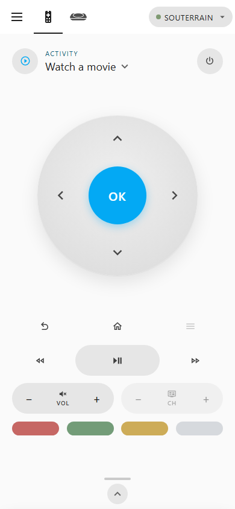

# Sofabaton X sidebar

After adding your hub, open **Sofabaton X** in Home
Assistant's sidebar. It opens a full-page remote designed for mobile screens, with no
dashboard setup needed. If you have several hubs, select one in the header.

## ◇ Use the remote

- Tap the Activity or Device name to open the picker. Choose an **Activity**
  to start it, or a **Device** to control it independently of Activities.
  Device mode requires **Persistent Cache**, enabled in **Control Panel → Settings**.
- Use the remote buttons for the selected Activity or Device. Unassigned
  buttons are dimmed; the available controls depend on your hub model.
- Hold a direction, volume, or channel button to repeat it. If the button has
  a long-press binding, holding it runs that binding instead.
- Tap the handle at the bottom for **Favorites** and **Macros** in Activity
  mode, or a searchable **Commands** list in Device mode.

Controls pause while an Activity starts or the hub is busy. Close the official
Sofabaton app if it is holding the hub connection.

## ◇ Open the Control Panel

Administrators can switch between **Virtual Remote** and **Control Panel**
using the header tabs; on narrow screens these show icons only. Other users
see only the remote.

The Control Panel provides hub editing, [automation setup](wifi_commands.md),
[backup and restore](backup.md), and [command editing](command_payloads.md).
These are the same tools available in the dashboard Control Panel card.

## ◇ Choose who sees it

Under **Control Panel → Settings → Sidebar Panel**, choose:

- **All users** (default): everyone gets the remote; administrators also get
  the Control Panel.
- **Admins only**: only administrators can access the sidebar panel.
- **Off**: remove the sidebar panel.

This setting applies to all hubs and takes effect immediately. If the panel
is off, use the [dashboard Control Panel card](../README.md#sofabaton-control-panel)
to enable it again.

## ◇ Reorder or hide the sidebar entry

Use Home Assistant's [sidebar customization](https://www.home-assistant.io/dashboards/dashboards/#reorganizing-items-in-the-sidebar)
to arrange your own sidebar:

1. Select your name at the bottom of the sidebar.
2. Under **User preferences**, find **Change the order and hide items from the
   sidebar** and select **Edit**. In some Home Assistant versions, this setting
   is under **Appearance**.
3. Drag items to reorder them, or toggle **Sofabaton X** off to hide its entry,
   then select **Save**.

You can also press and hold the sidebar header to enter edit mode.

Hiding the entry keeps the remote and Control Panel views available through
[dashboard navigation links](#-link-from-a-dashboard). Keep the integration's
**Sidebar Panel** setting on **All users** or **Admins only**: setting it to
**Off** removes the panel and its navigation destinations. Administrator-only
access still applies when opening a view through a link.

## ◇ Link from a dashboard

Use these paths as dashboard navigation targets:

| Destination                    | Path                          |
| ------------------------------ | ----------------------------- |
| Sidebar panel                  | `/sofabaton-x`                |
| Virtual Remote                 | `/sofabaton-x/virtual-remote` |
| Control Panel (administrators) | `/sofabaton-x/control-panel`  |

The tab-specific paths include a back arrow to return to the previous view.
