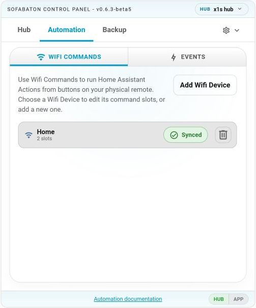
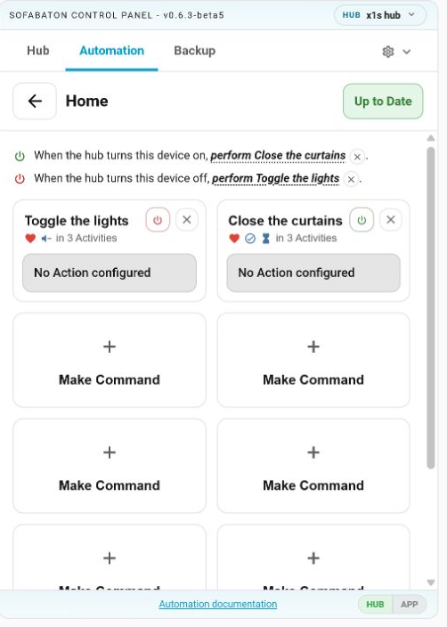
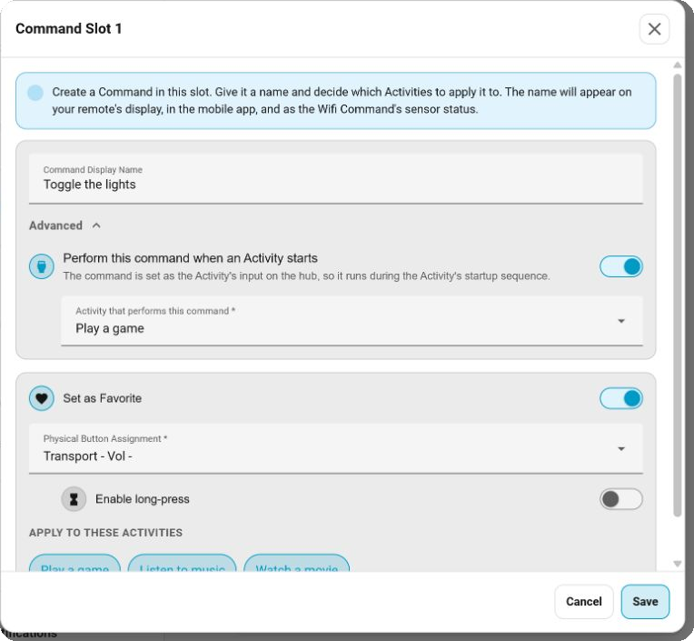
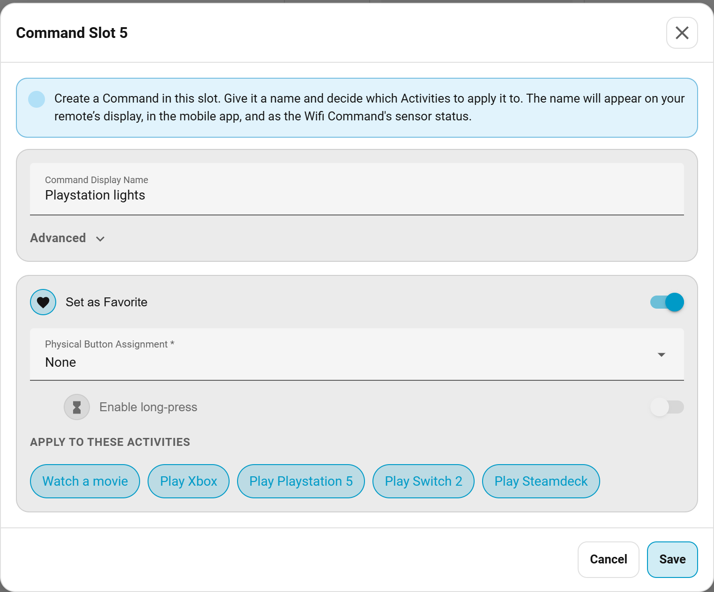
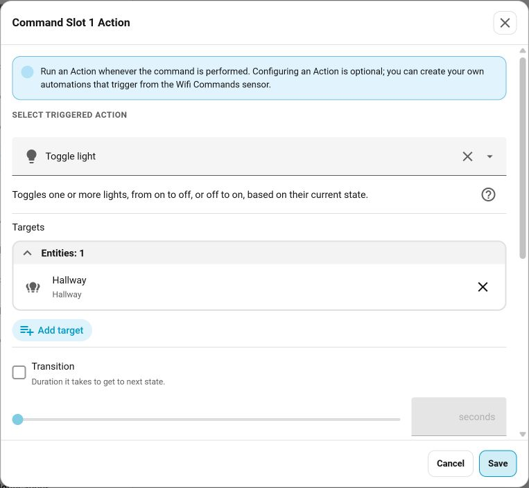
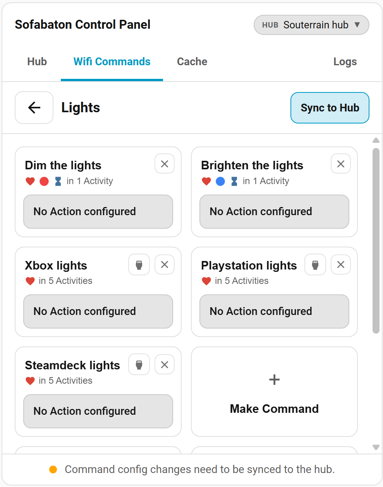
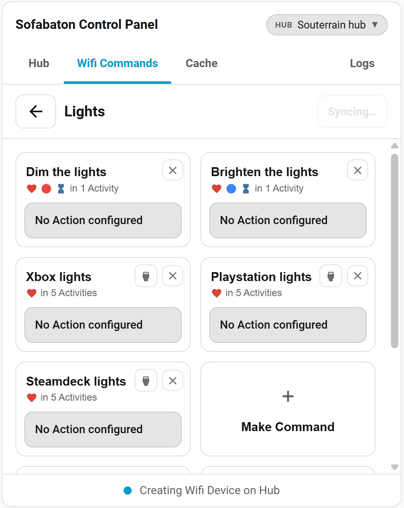

# Automation Assist: Wifi Commands

Run Home Assistant Actions when buttons are pressed on the physical remote.

In the **Sofabaton Control Panel** card, open the **Wifi Commands** tab. Up to **5 Wifi Devices** can be created per hub, each with 10 command slots.

1. **Add a Wifi Device**: Give it a name. Multiple devices are useful if you want separate logical groups of commands or separate power/input configurations per device.
2. **Make a new command**: Give it a name, assign it to a physical button and/or make it a favorite. Decide which Activities to deploy it to.
3. **Configure power / activity start** (optional; X1S/X2 hubs only — see the X1 note below): On the device's slot page, choose which command runs when the hub turns the device on or off. Alternatively, a command can be set to run when an Activity starts (it becomes the Wifi Device's input for that Activity on the hub). These commands become part of the Activity's startup and shutdown sequences.
4. **Configure an Action** to run whenever a key with the new command is pressed. These Actions run within the Home Assistant backend, the card is only there for configuration. **Configuring an Action is optional**: all Wifi Commands update status in `sensor.<hub>_wifi_commands`, so automations can be built to trigger from it.
5. **Sync to hub** once configuration is completed. This will deploy the configuration directly to the hub.

> - The first synchronization may take several minutes. During this time all other interactions with the hub are blocked.
> - Later syncs update the deployed device **in place** and only write what changed, so they are typically much faster (see "How re-syncing works" below).
> - Once configuration is successfully deployed to the hub, the physical remote is instructed to synchronize, which may take another few minutes to complete.
> - **Actions can be modified without the need to resync; you can add/remove and change them at any time**.

      

## How this works

Sofabaton hubs support a feature that it calls "Wifi Devices". Different types of these devices are supported on different hub versions, but what they have in common is that they achieve device control by sending HTTP requests, directly to that device.

What **Wifi Commands** does:

- Provides a mechanism for creating a "command configuration", which contains Command names, the physical button to attach it to, whether to create it as a favorite, the Activities to deploy it to and the Action to run whenever the command is triggered.
- Provides an HTTP Listener / Wifi Device to receive HTTP requests inbound from the hub.
- Deploys a Wifi Device to the hub, fully configured to contain the intended Command Names and correctly configured callback URLs. The type of device created depends on hub version.
- Directly runs the configured Action when a command key is pressed on the physical remote, if one was configured.
- Updates the status of `sensor.<hub>_wifi_commands` whenever a command key is pressed on the physical remote.

## Multiple Wifi Devices

Up to **5 Wifi Devices** can be created per hub. Each device has its own name, its own set of 10 command slots, and its own power/input configuration. This is useful for:

- Separating commands by logical group (e.g. one device for lighting scenes, another for audio presets).
- Assigning different power-on/off commands to different activities.

Devices are managed in the **Wifi Commands** tab of the Control Panel card. Each device is independent: syncing one device does not affect the others.

Renaming a deployed Wifi Device through the device editor (**Hub tab → Devices → Edit**) carries over automatically: the Wifi Commands configuration picks up the new name and the device stays in sync — no redeploy needed.

## Power control

Each Wifi Device can have a dedicated power **on** and power **off** command. These are configured at the top of the device's slot page:

- *When the hub turns this device on, perform: `<command>`*
- *When the hub turns this device off, perform: `<command>`*

The hub treats the Wifi Device as a real device, and will trigger power commands whenever an Activity change requires it.  
The commands are called in the startup and shutdown sequences of any Activity that has a command assigned from the Wifi Device.  
A single on and off command may be assigned per Wifi Device; the dropdowns list the device's configured commands and default to **Nothing**.

> Not available on X1 hubs — see [X1 hubs](#x1-hubs-no-power--activity-start-commands).

## Perform a command when an Activity starts

A command can be set (in its editor, under **Advanced**) to run whenever a chosen Activity starts.  
Under the hood the command becomes the Wifi Device's INPUT for that Activity on the hub, so it is called as part of the Activity's startup sequence.  
Each Wifi Device may assign a single command per Activity this way. The Wifi Commands UI enforces this. A command cannot be both a power command and an Activity-start command.

> Not available on X1 hubs — see [X1 hubs](#x1-hubs-no-power--activity-start-commands).

## Hub Events

At the bottom of the Wifi Devices list you can attach a Home Assistant Action to hub state changes:

- **When the hub is switched OFF** — the hub left an Activity and is now powered off.
- **When OFF is pressed while the hub is already OFF** — the OFF button was pressed with nothing left to turn off. Useful as a "force everything off" hook.
- **When an Activity starts** — the hub switched into any Activity.

Each line shows its configured Action; click it to change, or use the small ✕ to reset it to *do nothing*.

Unlike Wifi Commands, these hooks live entirely in Home Assistant: they are never synced to the hub and no sync is needed after changing them. They also require no Wifi Device or command slots — they work purely from the hub's reported activity state.

## Configuration

The **Wifi Commands** feature uses an HTTP listener that will by default attempt to bind to port `8060`.

> **⚠️ Emulated Roku**  
> If you are currently using Emulated Roku, these ports will conflict, causing either Emulated Roku or Wifi Commands to fail.

The port the HTTP listener binds to can be changed in the integration's general config, but doing so will break X1 compatibility. Other hub versions can freely change ports.
Detailed networking documentation is [here](networking.md).

Security note: this listener is meant for trusted LAN/VLAN traffic from the configured Sofabaton hub. It is not an internet-facing webhook endpoint; keep it behind your normal network firewall and see the [networking security model](networking.md#security--listener-model) for the listener-side checks.

## `sensor.<hub>_wifi_commands`

Updates whenever a Wifi Command key is pressed. Use it to build automations that respond to
any command without configuring individual Actions per command.

**State** resets to `Waiting for button press` after a short delay, so trigger on the
state _changing away_ from that value rather than on a specific command name.

**Attributes** at the moment of the press:

| Attribute          | Example value               | Description                 |
| ------------------ | --------------------------- | --------------------------- |
| `received_command` | `Scene Movie`               | Command name as configured  |
| `from_device`      | `Home Assistant`            | Wifi Device name            |
| `press_type`       | `short` / `long`            | Short or long press         |
| `timestamp`        | `2026-04-28T21:00:00+00:00` | ISO 8601 time of the press  |
| `source_ip`        | `192.168.1.50`              | IP the hub called back from |

**State value** when pressed: `<device>/<command>` or `<device>/<command>/longpress`  
**State value** at rest: `Waiting for button press`

### Automation example

```yaml
trigger:
  - platform: state
    entity_id: sensor.<hub>_wifi_commands # i.e. sensor.livingroom_wifi_commands
    not_to: "Waiting for button press"
action:
  - variables:
      command: "{{ trigger.to_state.attributes.received_command }}"

  - choose:
      - conditions:
          - condition: template
            value_template: "{{ command == 'Scene Movie' }}"
        sequence:
          - action: scene.turn_on
            target:
              entity_id: scene.movie_mode

      - conditions:
          - condition: template
            value_template: "{{ command == 'Scene Gaming' }}"
        sequence:
          - action: scene.turn_on
            target:
              entity_id: scene.gaming_mode
```

## Relevant entities

`sensor.<hub>_wifi_commands`  
Updates status whenever a Wifi Command key is pressed on the physical remote, the app or the virtual remote. Used for Automation triggers.

`switch.<hub>_wifi_device`  
Enables/Disables the HTTP listener / Wifi Device. Switched off by default. Automatically switched on when deploying Wifi Commands to the hub. Automatically switched off when removing all Wifi Commands.

`button.<hub>_resync_remote`  
Forces a resync of the physical remote. Automatically called at the end of a hub synchronization sequence.

## How re-syncing works: in-place updates, with replace as fallback

A re-sync (any sync after the first) now **edits the deployed Wifi Device in place**: only the records that actually changed are rewritten, nothing is deleted, and the device keeps its identity on the hub. That means anything you attached to the Wifi Device yourself through the Sofabaton app — extra Activity memberships, favorites, hard-button bindings, macro steps — keeps working across re-syncs. In-place updates are also much faster than a full deploy (a rename is a single record rewrite instead of a multi-minute redeploy).

A few situations still require the older **replace** behaviour (create the new device, move it into its Activities, then delete the old one):

- the **first deploy** of a Wifi Device (and the first sync after upgrading from an integration version that predates in-place updates),
- the **HTTP listener port changed** (the port is baked into the deployed records),
- the managed Wifi Device was **edited in the Sofabaton app** since the last sync (the integration detects this and re-deploys from your configuration),
- a command was **removed from an Activity where the Wifi Device is the only device** (see below).

When the replace path runs, two hub-firmware behaviours are worth knowing about (they are the hub's own — the same happens when the official app deletes a device):

- **Activities left with no devices are removed.** Whenever a device is deleted, the hub automatically deletes any Activity that ends up with **zero devices** as a result. This applies when you clear all Wifi Commands (which deletes the managed device without a replacement) or delete the device through the app. Add a second device to a Wifi-only Activity, or back up first, if you want to keep it through a removal.
- **A hard button the Wifi Command replaced is left unbound, not restored.** If you assign a Wifi Command to a physical button that already did something in an Activity, deploying overwrites the old binding. Removing the Wifi Command later clears that button — it does **not** put the original function back. Re-bind the button through the app or a backup restore if you need its old behaviour.

## X1 hubs: no power / Activity-start commands

X1 hub firmware only delivers a single power callback and a single Activity-start callback per Activity transition, no matter how many wifi-type devices take part in the startup sequence — so these features cannot work reliably alongside other wifi devices on that hub model. The power and Activity-start configuration is therefore **hidden for X1 hubs**; commands, favorites, hard buttons and Actions all work normally. X1S and X2 hubs are unaffected.

## Recovery

- This feature involves reconfiguring the hub, it is therefore a good idea to create a backup of your hub configuration before using this feature.
- If the **first deployment** of a Wifi Device fails, a rollback is performed and no trace will be left on the hub.
- If an **in-place update** is interrupted (for example the hub rejects a write mid-way), nothing is rolled back: every in-place write is an independent, safely repeatable edit. The device simply reads as out-of-step and the next sync picks up where it left off.
- Manual removal: this feature creates a Device on the Sofabaton hub. Removing it through the app is safe and removes the Wifi Commands configuration from your hub. The integration will notice hub configuration is no longer in sync, and provides the option to re-sync.

Please [open an issue](https://github.com/m3tac0de/home-assistant-sofabaton-x1s/issues) in case of any problems, make sure to [include detailed logs](logging.md).
