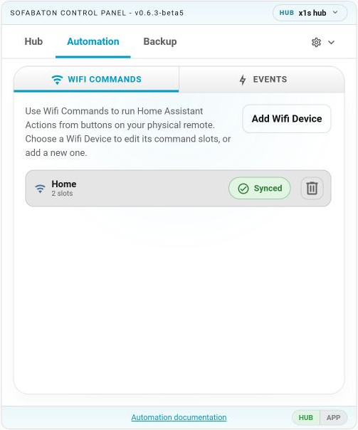
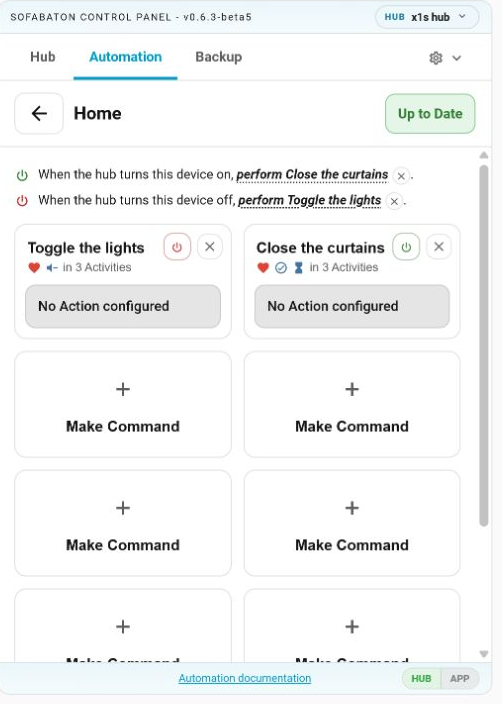
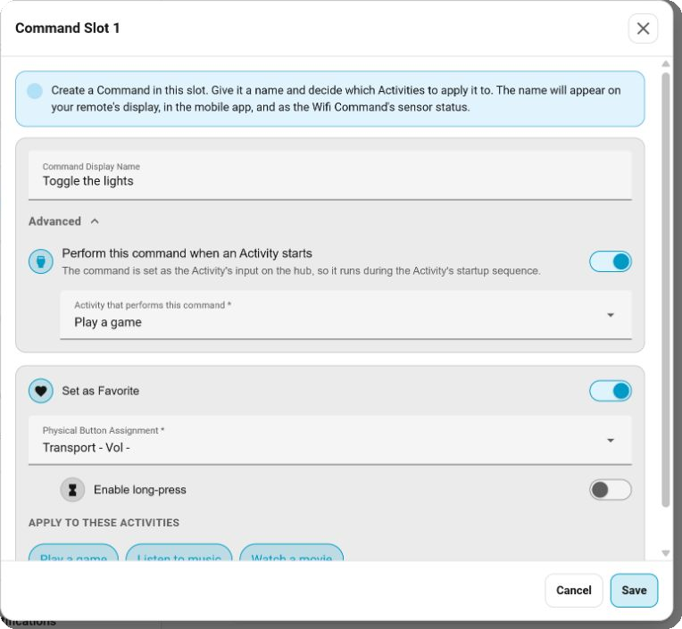
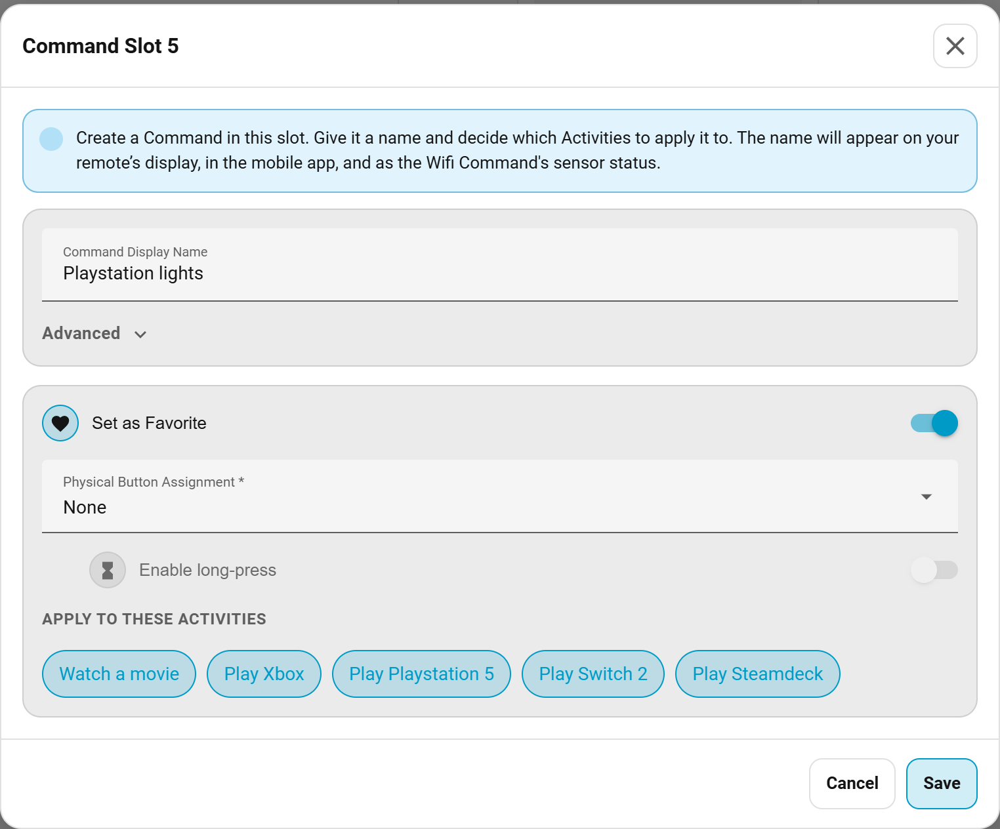
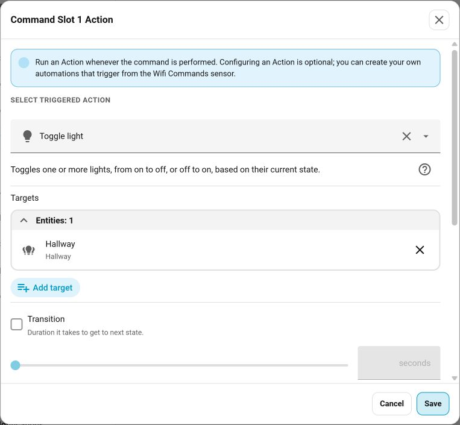
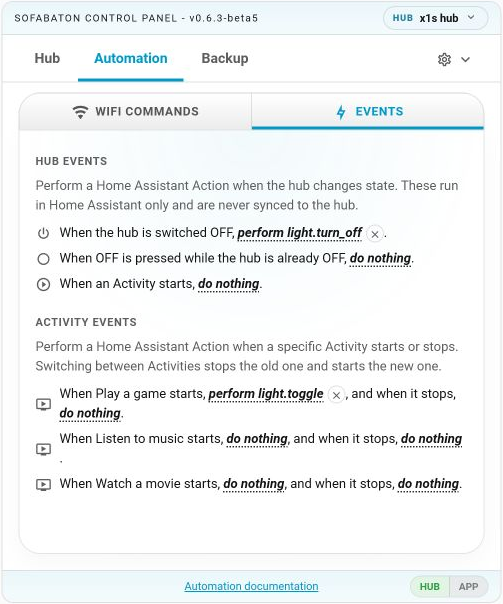

# Automation

Run Home Assistant Actions when buttons are pressed on the physical remote.

In the **Sofabaton Control Panel** card, open **Automation → Wifi Commands**. Up to **5 Wifi Devices** can be created per hub, each with 10 command slots.

1. **Add a Wifi Device**: Give it a name. Multiple devices are useful if you want separate logical groups of commands or separate power/input configurations per device.
2. **Make a new command**: Give it a name, assign it to a physical button and/or make it a favorite. Decide which Activities to deploy it to.
3. **Configure power / activity start** (optional; X1S/X2 hubs only — see the X1 note below): On the device's slot page, choose which command runs when the hub turns the device on or off. Alternatively, a command can be set to run when an Activity starts (it becomes the Wifi Device's input for that Activity on the hub). These commands become part of the Activity's startup and shutdown sequences.
4. **Configure an Action** to run whenever a key with the new command is pressed. These Actions run within the Home Assistant backend, the card is only there for configuration. **Configuring an Action is optional**: all Wifi Commands update status in `sensor.<hub>_wifi_commands`, so automations can be built to trigger from it.
5. **Sync to hub** once configuration is completed. This will deploy the configuration directly to the hub.

> - The first synchronization may take several minutes. During this time all other interactions with the hub are blocked.
> - Later syncs update the deployed device **in place** and only write what changed, so they are typically much faster (see "How re-syncing works" below).
> - Once configuration is successfully deployed to the hub, the physical remote is instructed to synchronize, which may take another few minutes to complete.
> - **Actions can be modified without the need to resync; you can add/remove and change them at any time**.

    

## How this works

Sofabaton hubs support a feature that it calls "Wifi Devices". Different types of these devices are supported on different hub versions, but what they have in common is that they achieve device control by sending HTTP requests, directly to that device.

What **Wifi Commands** does:

- Provides a mechanism for creating a "command configuration", which contains Command names, the physical button to attach it to, whether to create it as a favorite, the Activities to deploy it to and the Action to run whenever the command is triggered.
- Provides an HTTP Listener / Wifi Device to receive HTTP requests inbound from the hub.
- Deploys a Wifi Device to the hub, fully configured to contain the intended Command Names and correctly configured callback URLs. The type of device created depends on hub version.
- Directly runs the configured Action when a command key is pressed on the physical remote, if one was configured.
- Updates the status of `sensor.<hub>_wifi_commands` whenever a command key is pressed on the physical remote.

## Multiple Wifi Devices

Up to **5 Wifi Devices** can be created per hub. Each device has its own name, its own set of 10 command slots, and its own power/input configuration. This is useful for:

- Separating commands by logical group (e.g. one device for lighting scenes, another for audio presets).
- Assigning different power-on/off commands to different activities.

Devices are managed under **Automation → Wifi Commands** in the Control Panel card. Each device is independent: syncing one device does not affect the others.

Renaming a deployed Wifi Device through the device editor (**Hub tab → Devices → Edit**) carries over automatically: the Wifi Commands configuration picks up the new name and the device stays in sync — no redeploy needed.

The rest of a managed Wifi Device is **read-only in the live device editor** — its commands, power/input, and button assignments are owned by the Wifi Commands tab, and editing them elsewhere would be overwritten on the next sync. Opening one in **Hub tab → Devices → Edit** shows a *Managed by Wifi Commands* notice; make those changes in the Wifi Commands tab instead. (References you add to the device *outside* Wifi Commands — an extra favorite, a hard-button binding, or adding it to another Activity through the Sofabaton app — are left alone by re-syncs and keep working.)

## Power control

Each Wifi Device can have a dedicated power **on** and power **off** command. These are configured at the top of the device's slot page:

- *When the hub turns this device on, perform: `<command>`*
- *When the hub turns this device off, perform: `<command>`*

The hub treats the Wifi Device as a real device, and will trigger power commands whenever an Activity change requires it.  
The commands are called in the startup and shutdown sequences of any Activity that has a command assigned from the Wifi Device.  
A single on and off command may be assigned per Wifi Device; the dropdowns list the device's configured commands and default to **Nothing**.

> Not available on X1 hubs — see [X1 hubs](#x1-hubs-no-power--activity-start-commands).

## Perform a command when an Activity starts

A command can be set (in its editor, under **Advanced**) to run whenever a chosen Activity starts.  
Under the hood the command becomes the Wifi Device's INPUT for that Activity on the hub, so it is called as part of the Activity's startup sequence.  
Each Wifi Device may assign a single command per Activity this way. The Wifi Commands UI enforces this. A command cannot be both a power command and an Activity-start command.

> Not available on X1 hubs — see [X1 hubs](#x1-hubs-no-power--activity-start-commands).

## Device-page keys and button groups

A command assigned to a physical button is also bound on the Wifi Device's **own device page** whenever the claim is unambiguous (no other command on the same device uses that button). This has two effects:

- Pressing the key on the remote's device page for the Wifi Device triggers the command directly.
- The Wifi Device becomes selectable as a **button-group controller** in the live activity editor — for example, a device with volume-key commands can be chosen as the device that handles *Volume* in an Activity, exactly like a regular device.

If two commands claim the same button (for different Activities), no device-page key is written for that button — the per-Activity assignments simply apply as configured.

## Hub Events

The **Events** sub-tab (next to **Wifi Commands**) contains **Hub Events**, **Wifi Events**, and **Activity Events** sections. Under **Hub Events**, you can attach a Home Assistant Action to hub state changes:

- **When the hub is switched OFF** — the hub left an Activity and is now powered off.
- **When OFF is pressed while the hub is already OFF** — the OFF button was pressed with nothing left to turn off. Useful as a "force everything off" hook.
- **When any Activity starts** — the hub switched into any Activity — **and when one stops** — the hub left any Activity, either by powering off or by switching into another one.

Below those, **Activity Events** list every Activity on the hub with a start and a stop hook:

- **When \<Activity\> starts** — the hub switched into that Activity.
- **and when it stops** — the hub left that Activity, either by powering off or by switching directly into another Activity (the old Activity's stop hook runs before the new one's start hook).

Each line shows its configured Action; click it to change, or use the small ✕ to reset it to *do nothing*. When an event fires, its row briefly lights up — the same live indicator the Wifi Device cards show for incoming command presses.

Activity Events are tied to the hub's Activity **id** only; no name matching is attempted. If you delete an Activity, its configured hooks are cleaned up automatically the next time the integration refreshes the Activity list, and if the hub later reuses that id for a new Activity, a hook configured before the cleanup would simply apply to the new Activity.

Unlike Wifi Commands, these hooks live entirely in Home Assistant: they are never synced to the hub and no sync is needed after changing them. They also require no Wifi Device or command slots — they work purely from the hub's reported activity state.



## Wifi Events

**Wifi Events** are remote-triggered Home Assistant hooks you place *inside* your Activities: a shortcut on the remote's touch screen, a physical button (short or long press), or a step in a macro. Pressing one fires its Home Assistant Action — no device control involved.

They are the quickest way to say *"when I press this on the remote, do something in Home Assistant"* without configuring a full Wifi Device: creating one only asks for a name.

### Creating and deploying Wifi Events

Wifi Events are created from the **live activity editor** (Hub tab → Activities → Edit). Every **Add** dialog — shortcut, button assignment (either press), and macro step — offers a **Wifi Event** kind alongside device commands and macros:

- Pick an existing event, or choose **Create new Wifi Event…** and give it a name.
- Saving the Add dialog stores a new event in the integration and stages its Activity reference. **Nothing is written to the hub yet.**
- Press **Sync** in the Activity editor. The integration first deploys or updates the shared Wifi Events device, resolves its real hub id when this is the first event, and then writes the Activity change that references it.
- The first deployment creates the Wifi Events device and can take about a minute. Later event updates are normally much quicker.
- If the events-device phase fails, the Activity write does not start. The staged event remains listed with a **needs sync** badge; return to the affected Activity and press **Sync** again.
- If you leave the Activity editor without syncing, the new event remains staged but is not deployed. Select it again while editing an Activity, add the reference, and press **Sync**.

Up to **25 events** can exist per hub, each with an optional long-press variant.

### Managing Wifi Events

As soon as an event is staged, it appears in **Automation → Events** under **WIFI EVENTS**. This section manages Home Assistant Actions; the live Hub editors manage the event's hub-side lifecycle.

- Click the action link to attach or change the Home Assistant Action. Action changes apply immediately and need no hub sync. The small ✕ resets an Action to *do nothing*.
- Assigning an event to both legs of a physical-button binding enables its separate long-press Action. Configure that Action from the event's second action link.
- A **needs sync** badge means the event definition has not reached the hub yet. It is informational; complete the pending Activity sync, or add the staged event to an Activity and sync that Activity if the original edit was discarded.
- When an event fires, its row briefly lights up — the same live indicator the Wifi Device cards show.

Every Wifi Event press also updates `sensor.<hub>_wifi_commands`, so you can build automations that trigger from the sensor instead of (or in addition to) the attached Action.

### The "Wifi Events" device

Behind the scenes, all events live on a single hub device named **Wifi Events**. It never appears in the Wifi Devices list — the Events section above is its home — but since it is a genuine hub device you will see it on the remote's device list and in backups.

Unlike user-managed Wifi Devices, this device is editable under **Hub → Devices → Wifi Events → Edit**:

- Rename the device or an event there, then press **Sync**. The Wifi Events configuration follows the new hub-side name.
- Delete an event from the Commands section, then press **Sync**. Its paired short- and long-press records are removed together. The hub also removes shortcuts and button assignments that reference it, removes its steps from macros, and removes any macro left with no steps.
- Create new events only from an Activity editor's Add dialogs. Adding command records directly to the Wifi Events device is intentionally blocked.

Wifi Events work on **all hub versions, including the X1** — the power/Activity-start restrictions below do not apply to them (they use neither power nor input slots).

## MQTT delivery (X2)

On an **X2 hub** with the Home Assistant **MQTT integration** loaded, a new Wifi Device can deliver its presses over MQTT instead of HTTP. The choice appears when you create the device (MQTT is pre-selected when available) and every device shows an `MQTT` or `HTTP` pill telling you how it is, or will be, deployed.

Why MQTT:

- **Faster.** Measured on real hardware, an MQTT press reaches Home Assistant about 130 ms sooner at the median than an HTTP callback. You can feel the difference on lights.
- **No listener.** MQTT devices need no HTTP callback listener: no port `8060`, no Emulated Roku conflict, no inbound firewall or VLAN rule, and `switch.<hub>_wifi_device` stays off in an MQTT-only setup.
- **Nothing network-local in the records.** HTTP callbacks embed Home Assistant's IP and listener port on the hub, which is why changing either forces a redeploy. MQTT records contain neither, so those redeploy triggers disappear. Deploys are also much faster.

What you need: the hub's MQTT broker must be configured **in the Sofabaton app** (host, port, credentials), pointing at the same broker your Home Assistant MQTT integration uses. The integration cannot read or verify that setting; the broker link is yours to manage. The quickest sanity check after a deploy is pressing one of the device's commands on the remote and watching `sensor.<hub>_wifi_commands` update with `transport: mqtt`. If nothing arrives, check the app's broker settings first.

Things to know:

- **The hub's real MAC address must be known.** The press topic on the broker is the hub's own MAC, which the integration learns from mDNS discovery. A hub that was **added manually** (by IP, typically across VLANs without mDNS forwarding) carries a placeholder identity instead, so the MQTT option is not offered for it; it appears automatically once mDNS identifies the hub.
- **The transport is fixed at first deploy.** The pill is read-only afterwards; switching a deployed device's transport means deleting and recreating it, with the same cautions as any full re-deploy (see "How re-syncing works" below).
- **Existing devices are never migrated.** A device deployed over HTTP keeps working over HTTP forever unless you explicitly recreate it.
- **Hold behavior differs.** Holding a button on an HTTP device makes the hub repeat the request roughly 4 times per second for as long as you hold, and each repeat fires the Action and updates the sensor. An MQTT device publishes **once** per press (short or long). If you trigger automations from the sensor, expect churn during a hold on HTTP and a single update on MQTT.
- **Security.** Anyone with write access to your broker can publish a fake press and run the command's Action. Give the hub's broker user a narrow ACL, and treat broker credentials like any other automation credential. The HTTP listener's source-IP check has no MQTT equivalent.
- **Messages are not queued.** If Home Assistant is down when a press happens, an HTTP callback fails loudly on the hub side (it retries delivery); an MQTT press is simply gone.

## Configuration

Wifi Commands and Wifi Events share an HTTP callback listener that attempts to bind to port `8060` by default.

> **⚠️ Emulated Roku**  
> If you are currently using Emulated Roku, the ports conflict, causing either Emulated Roku or the Sofabaton callback listener to fail.

The port the HTTP listener binds to can be changed in the integration's general config, but doing so will break X1 compatibility. Other hub versions can freely change ports.
Detailed networking documentation is [here](networking.md).

Security note: this listener is meant for trusted LAN/VLAN traffic from the configured Sofabaton hub. It is not an internet-facing webhook endpoint; keep it behind your normal network firewall and see the [networking security model](networking.md#security--listener-model) for the listener-side checks.

## `sensor.<hub>_wifi_commands`

Updates whenever a deployed Wifi Command or Wifi Event is triggered. Use it to build automations that respond to either callback type without configuring an individual Action.

**State** resets to `Waiting for button press` after a short delay, so trigger on the
state _changing away_ from that value rather than on a specific command name.

**Attributes** at the moment of the press:

| Attribute          | Example value               | Description                 |
| ------------------ | --------------------------- | --------------------------- |
| `received_command` | `Scene Movie`               | Command name as configured  |
| `from_device`      | `Home Assistant`            | Wifi Device name (`Wifi Events` for an event) |
| `press_type`       | `short` / `long`            | Short or long press         |
| `timestamp`        | `2026-04-28T21:00:00+00:00` | ISO 8601 time of the press  |
| `source_ip`        | `192.168.1.50`              | IP the hub called back from; empty for MQTT deliveries |
| `transport`        | `http` / `mqtt`             | How the press reached Home Assistant |

**State value** when pressed: `<device>/<command>` or `<device>/<command>/longpress`  
**State value** at rest: `Waiting for button press`

### Automation example

```yaml
trigger:
  - platform: state
    entity_id: sensor.<hub>_wifi_commands # i.e. sensor.livingroom_wifi_commands
    not_to: "Waiting for button press"
action:
  - variables:
      command: "{{ trigger.to_state.attributes.received_command }}"

  - choose:
      - conditions:
          - condition: template
            value_template: "{{ command == 'Scene Movie' }}"
        sequence:
          - action: scene.turn_on
            target:
              entity_id: scene.movie_mode

      - conditions:
          - condition: template
            value_template: "{{ command == 'Scene Gaming' }}"
        sequence:
          - action: scene.turn_on
            target:
              entity_id: scene.gaming_mode
```

## Relevant entities

`sensor.<hub>_wifi_commands`  
Updates whenever a deployed Wifi Command or Wifi Event is triggered from the physical remote, the Sofabaton app, or a virtual remote. Used for automation triggers.

`switch.<hub>_wifi_device`  
Enables or disables the shared HTTP callback listener. It is off by default and is enabled automatically when a Wifi Commands device or the Wifi Events device is deployed over HTTP. The integration turns it off automatically only after no deployed callback device still needs it. Devices deployed over MQTT do not need the listener and do not count towards it. Turning it off manually prevents HTTP-delivered Wifi Command and Wifi Event Actions and sensor updates from being received.

`button.<hub>_resync_remote`  
Forces a resync of the physical remote. Automatically called at the end of a hub synchronization sequence.

## How re-syncing works: in-place updates, with replace as fallback

A re-sync (any sync after the first) now **edits the deployed Wifi Device in place**: only the records that actually changed are rewritten, nothing is deleted, and the device keeps its identity on the hub. That means anything you attached to the Wifi Device yourself through the Sofabaton app — extra Activity memberships, favorites, hard-button bindings, macro steps — keeps working across re-syncs. In-place updates are also much faster than a full deploy (a rename is a single record rewrite instead of a multi-minute redeploy).

A few situations still require the older **replace** behaviour (create the new device, move it into its Activities, then delete the old one):

- the **first deploy** of a Wifi Device (and the first sync after upgrading from an integration version that predates in-place updates),
- the **HTTP listener port changed** (the port is baked into the deployed records),
- the managed Wifi Device was **edited in the Sofabaton app** since the last sync (the integration detects this and re-deploys from your configuration),
- a command was **removed from an Activity where the Wifi Device is the only device** (see below).

When the replace path runs, two hub-firmware behaviours are worth knowing about (they are the hub's own — the same happens when the official app deletes a device):

- **Activities left with no devices are removed.** Whenever a device is deleted, the hub automatically deletes any Activity that ends up with **zero devices** as a result. This applies when you clear all Wifi Commands (which deletes the managed device without a replacement) or delete the device through the app. Add a second device to a Wifi-only Activity, or back up first, if you want to keep it through a removal.
- **A hard button the Wifi Command replaced is left unbound, not restored.** If you assign a Wifi Command to a physical button that already did something in an Activity, deploying overwrites the old binding. Removing the Wifi Command later clears that button — it does **not** put the original function back. Re-bind the button through the app or a backup restore if you need its old behaviour.

## X1 hubs: no power / Activity-start commands

X1 hub firmware only delivers a single power callback and a single Activity-start callback per Activity transition, no matter how many wifi-type devices take part in the startup sequence — so these features cannot work reliably alongside other wifi devices on that hub model. The power and Activity-start configuration is therefore **hidden for X1 hubs**; commands, favorites, hard buttons and Actions all work normally. X1S and X2 hubs are unaffected.

## Recovery

- This feature involves reconfiguring the hub, it is therefore a good idea to create a backup of your hub configuration before using this feature.
- If the **first deployment** of a Wifi Device fails, a rollback is performed and no trace will be left on the hub.
- If an **in-place update** is interrupted (for example the hub rejects a write mid-way), nothing is rolled back: every in-place write is an independent, safely repeatable edit. The device simply reads as out-of-step and the next sync picks up where it left off.
- Manual removal: this feature creates a Device on the Sofabaton hub. Removing it through the app is safe and removes the Wifi Commands configuration from your hub. The integration will notice hub configuration is no longer in sync, and provides the option to re-sync.

Please [open an issue](https://github.com/m3tac0de/home-assistant-sofabaton-x1s/issues) in case of any problems, make sure to [include detailed logs](logging.md).
